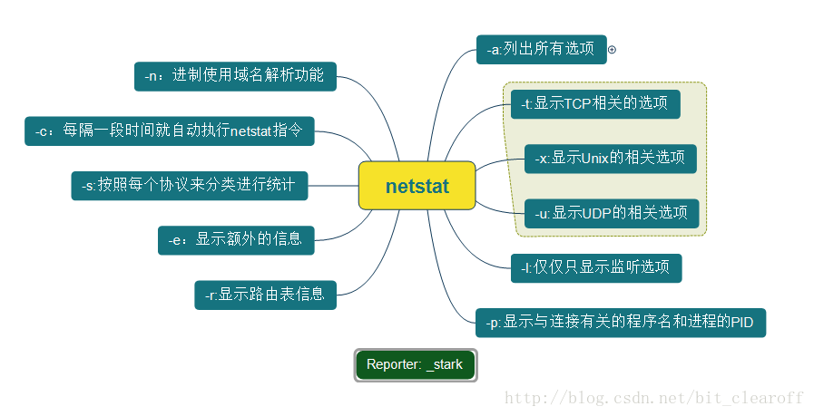

### 基础命令

查找文件地址
```
find / -name 文件名
```


压缩（tar）
```
tar -cvf /tmp/etc.tar /etc  <==仅打包，不压缩
tar -czvf /tmp/etc.tar.gz /etc  <==打包后，以 gzip 压缩
tar -cjvf /tmp/etc.tar.bz2 /etc  <==打包后，以 bzip2 压缩

```

history（查阅历史命令）
```
```

ssh命令(远程登录)
```
普通登录（默认22端口）
ssh user@hostname

指定端口登录
ssh -p 10022 user@hostname

免密登录（将本地ssh秘钥上传远程服务器）
ssh-copy-id user@server

生成公私匙
ssh-keygen -t 'rsa'
```

grep命令（字符串匹配）
```

```


Netstat（显示各种网络相关信息）

```
列出所有当前的连接
netstat -a

netstat -at
列出 TCP 协议的连接

列出 UDP 协议的连接
netstat -au

使用 -n 选项禁用域名解析功能
netstat -ant

使用 -l 只列出监听中的连接
nestat -ntl

```
